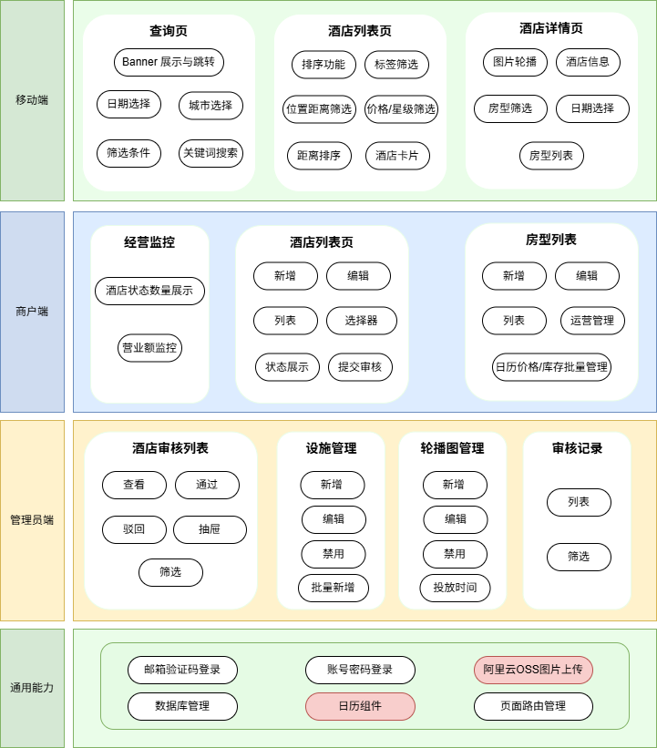

# yisu-hotel （易宿酒店预定平台）

[项目概览](#项目概览)

[功能模块图](#功能模块图)

[技术选型](#技术选型)

[功能说明](#功能说明)

[文件目录结构](#文件目录结构)

本项目是一个酒店在线预订平台，使用这个平台，商户可以实现创建并维护酒店，管理员可以审核酒店，用户可以搜索并浏览酒店信息。项目基于React 18 + React Native + AntD + TS + NestJS + GraphQL + TypeOrm + Mysql。

# 项目概览

| **端** | **面向用户** | **主要能力** | **目录** |
| --- | --- | --- | --- |
| 移动端 | C 端用户 | 酒店查询/筛选/详情/房型价格浏览 | `yisu/client-mobile/` |
| PC 管理端 | 商户 / 管理员 | 酒店信息管理、房型管理、审核发布、运营配置、轮播图管理、设施管理 | `yisu/client-pc/` |
| 后端服务 | 三端共用 | GraphQL API、JWT、角色权限、数据持久化 | `yisu/server/` |

# 功能模块图



# 技术选型

- 移动端：React Native、@apollo/client、Ant Design React Native、Redux Toolkit
- PC端：React、Ant Design、Zustand
- 后端：NestJS、GraphQL、Apollo Server、TypeORM、MySQL

# 功能说明

## 移动端

- 查询页
  
    Banner 展示与跳转、城市选择/定位、关键词搜索、多种筛选条件
    
- 酒店列表页
  
    按评分、价格等排序，位置距离（根据地标）、上滑自动加载、设施/价格/星级筛选
    
- 酒店详情页
  
    顶部导航、 Banner 左右滑动、酒店基础信息、房型价格列表、房型筛选
    

## PC端

### 通用能力

- 个人中心：右上角用户名可点击进入 /profile 修改用户名/密码/头像
- 邮箱验证码登录/注册
- 地图选点组件（使用百度地图api）
- 商户酒店列表组件

### 管理员

- 仪表盘
- 酒店审核列表（查看/通过/驳回）
  
    支持商户、酒店名称、城市、星级的筛选，做了防抖处理
    
- 标签/设施管理（支持批量新增、删除、禁用）
- 首页banner管理（支持设置投放时间）
- 审核记录
  
    显示操作人、操作类型、操作酒店，
    

### 商户

- 经营监控
- 酒店新建/编辑
  
    酒店状态区分与对应操作：
    
    | 状态 | 操作 |
    | --- | --- |
    | 已发布 | 日常管理（价格/库存）、编辑、下线 |
    | 审核中 | 查看（不可编辑）、撤回 |
    | 草稿（从未发布过） | 编辑、提交审核、删除 |
    | 更改待提交（已发布后修改） | 编辑、提交审核、查看 |
    | 下线 | 编辑、申请上线 |
    
    只有创建后从未发布过的酒店是草稿，可以删除，其余的均不可删除，只支持下线操作 （可恢复上线，需经过审核）。
    
    其中，酒店基础信息以及房型信息的修改会触发审核，房型价格和库存等运营相关信息不需要审核，修改后立即生效。
    
- 房型新建/编辑
  
    价格、库存、类型、图片。支持日常价格管理，日历价格、日历库存批量管理
    

# 文件目录结构

移动端 `yisu/client-mobile/`

```jsx
yisu/client-mobile/
└── src/
    ├── pages/                         # 三大核心页面
    │   ├── SearchPage.tsx             # 酒店查询页（首页）
    │   ├── ListPage.tsx               # 酒店列表页
    │   └── DetailPage.tsx             # 酒店详情页
    │
    ├── components/                    # 移动端通用组件
    │   ├── ListHeader.tsx             # 列表页顶部条件栏
    │   ├── CitySelectorModal.tsx      # 城市选择弹窗
    │   ├── GuestSelectorModal.tsx     # 入住人数/间夜选择弹窗
    │   ├── DateSelectorModal.tsx      # 日期选择弹窗（查询/列表）
    │   ├── CustomCalendar.tsx         # 日历组件（查询/列表）
    │   ├── PriceStarFilterModal.tsx   # 价格/星级筛选弹窗
    │   ├── RoomFilterModal.tsx        # 房型/设施筛选弹窗
    │   ├── LocationFilterModal.tsx    # 位置/距离筛选弹窗
    │   ├── Detail-DateSelectModal.tsx # 详情页日期选择弹窗
    │   └── Detail-CustomCalendar.tsx  # 详情页日历组件
    │
    ├── graphql/                       # 移动端 GraphQL 定义
    **├──** services/                      # 移动端业务调用封装（hooks/services）
    ├── store/                         # Redux Toolkit 状态
    ├── utils/
    ├── constants/
    ├── types/                         # TS 类型定义
```

pc端 `yisu/client-pc/`

```jsx
yisu/client-pc/
└── src/
    ├── main.tsx
    ├── componenets/                  
    │   ├── RouteGuard/                # 路由守卫（鉴权/角色）
    │   ├── GuestGuard/                # 游客访问守卫
    │   ├── CitySelector/              # 城市选择器
    │   ├── FacilitySelector/          # 设施选择器
    │   ├── MapPicker/                 # 地图选点组件
    │   ├── OSSImageUpload/            # OSS图片上传组件
    │   └── RoomTypeList/              # 房型列表组件
    │
    ├── containers/                     # 页面容器
    │   ├── Layout/                     # PC 容器
    │   ├── Login/                      # PC 登录
    │   ├── Register/                   # PC 注册
    │   ├── Profile/                    # PC 个人信息
    │   │
    │   ├── merchant/
    │   │   ├── HotelList/              # PC 商户酒店列表
    │   │   ├── HotelEdit/              # PC 商户酒店编辑页，包括酒店基础信息、房型编辑列表、房型编辑页
    │   │   ├── RoomManagement/         # PC 商户房型运营管理列表
    │   │   └── Monitor/                # PC 商户经营监控
    │   │
    │   └── admin/
    │       ├── Dashboard/              # PC 管理员仪表盘
    │       ├── HotelList/              # PC 酒店审核列表页面，包括酒店详情页抽屉，驳回模态框
    │       ├── AuditRecords/           # PC 审核记录
    │       ├── Banners/                # PC 轮播图管理页面
    │       └── Facilities/             # PC 设施管理页面+批量添加模态框组件
    │
    ├── graphql/                        # PC GraphQL 定义
    ├── services/                       # PC 端请求封装（与 graphql 对应）
    ├── routes/
    ├── store/
    ├── hooks/
    ├── constants/
    └── utils/

```