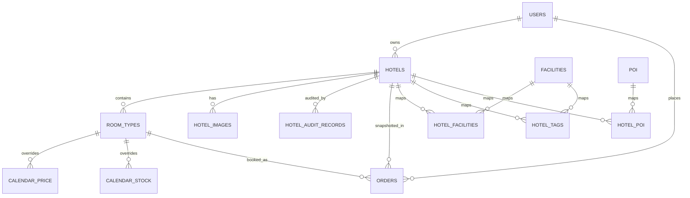

# P3 数据字典与关系说明

## 1. 表清单

| 表 | 用途 | 主键/关键唯一键 | 关键关系 |
|---|---|---|---|
| `users` | 客户、商户和管理员账号 | `id`；`username`、`email` 唯一 | 商户拥有酒店；用户拥有订单 |
| `hotels` | 酒店主体、地址、状态和展示数据 | `id`；`hotelID` 唯一 | `merchantId -> users.id` |
| `hotel_images` | 酒店图片 | `id` | `hotelId -> hotels.id`，级联删除 |
| `room_types` | 房型、基础价和基础库存 | `id` | `hotelId -> hotels.id`，级联删除 |
| `calendar_price` | 房型每日覆盖价格 | `id`；`roomTypeId + date` 唯一 | `roomTypeId -> room_types.id`，级联删除 |
| `calendar_stock` | 房型每日覆盖库存 | `id`；`roomTypeId + date` 唯一 | `roomTypeId -> room_types.id`，级联删除 |
| `facilities` | 设施和标签字典 | `id` | 被酒店设施/标签关联表引用 |
| `hotel_facilities` | 酒店—设施多对多 | `hotelId + facilityId` | 两端级联删除 |
| `hotel_tags` | 酒店—标签多对多 | `hotelId + tagId` | 两端级联删除 |
| `poi` | 城市景点、交通、商场等 POI | `id`；`name + city + type` 唯一 | 被 `hotel_poi` 引用 |
| `hotel_poi` | 酒店—POI 关联 | `id`；`hotelId + poiId` 唯一 | 两端级联删除 |
| `hotel_audit_records` | 酒店状态变化审计 | `id` | 酒店限制删除；操作人删除时置空 |
| `banners` | 首页 Banner 配置 | `id` | `targetHotelId` 是允许失效的软引用 |
| `orders` | 订单快照、金额和库存扣减日期 | `id` | 用户/酒店/房型均限制删除 |

`alembic_version` 是迁移管理表，不属于业务 14 表。

## 2. 核心关系

## 3. 类型规则

- 数据库 UUID/标识：`VARCHAR(36)`，继续兼容已有字符串 UUID。
- 营业日期：MySQL `DATE`；Python `datetime.date`；API 边界使用 `YYYY-MM-DD`。
- 审计时间：MySQL `DATETIME(6)`；应用层统一按 UTC 写入，展示层再转换时区。
- 金额：酒店/房型/日历为 `DECIMAL(10,2)`，订单总额为 `DECIMAL(12,2)`。
- 坐标：酒店沿用 `DOUBLE`；POI 沿用 `DECIMAL(10,6)`。
- JSON：只存储结构化附加数据和 ID 列表，不承担核心关系完整性。

## 4. 约束重点

- 酒店状态限定为 `0..4`，对应 DRAFT、REVIEWING、REJECTED、PUBLISHED、OFFLINE。
- 酒店星级限定 `0..10`，评分限定 `0..5`，经纬度限定合法范围。
- 房价、订单金额、库存、收藏数和失败次数不得为负。
- 房型最大入住人数和订单入住人数必须大于 0。
- 订单必须满足 `checkOut > checkIn`。
- Banner 同时存在开始、结束时间时必须满足 `endAt > startAt`。

业务状态转换、价格优先级和取消规则仍以 P0 `domain-rules.md` 为准；数据库约束是最后一道防线，不能代替 P4～P8 的业务校验。
